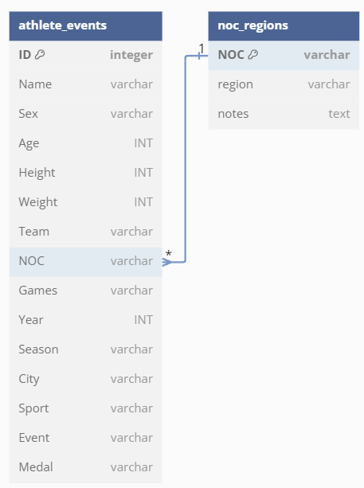

# Practicing SQL with a real dataset

The objective of this notebook is to practice SQL commands on a real dataset. This describes 120 years of Olympics participations, recording athletes information, where they competed, what they won, etc. 

## Download the dataset

To reproduce the results of the query, you will have to download the dataset I've used <a href="https://techtfq.com/s/Olympics_data.zip"> here</a>.

## Dataset structure

The structure is the following:

## Questions

1. How many olympics games have been held?

2. List down all Olympics games held so far.

3. Mention the total no of nations who participated in each olympics game?

4. Which year saw the highest and lowest no of countries participating in olympics?

5. Which nation has participated in all of the olympic games?

6. Identify the sport which was played in all summer olympics.

7. Which Sports were just played only once in the olympics?

8. Fetch the total no of sports played in each olympic games.

9. Fetch details of the oldest athletes to win a gold medal.

10. Find the Ratio of male and female athletes participated in all olympic games.

11. Fetch the top 5 athletes who have won the most gold medals.

12. Fetch the top 5 athletes who have won the most medals (gold/silver/bronze).

13. Fetch the top 5 most successful countries in olympics. Success is defined by no of medals won.

14. List down total gold, silver and broze medals won by each country.

15. List down total gold, silver and broze medals won by each country corresponding to each olympic games.

16. Identify which country won the most gold, most silver and most bronze medals in each olympic games.

17. Identify which country won the most gold, most silver, most bronze medals and the most medals in each olympic games.

18. Which countries have never won gold medal but have won silver/bronze medals?

19. In which Sport/event, India has won highest medals.

20. Break down all olympic games where india won medal for Hockey and how many medals in each olympic games.